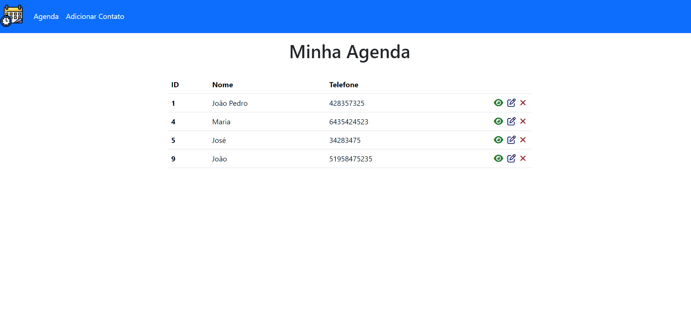

# Contact Book

### Project Summary: Building a Contact Management System

This project involves the development of a contact management system using PHP, HTML, CSS, and MySQL. The system allows users to add, view, edit, and delete contacts.

### Technologies Used:

1. **PHP (Hypertext Preprocessor):** Used for server-side scripting, handling form submissions, and interacting with the database.

2. **HTML (Hypertext Markup Language):** Used for creating the structure of web pages, including forms for user interaction.

3. **CSS (Cascading Style Sheets):** Used for styling the HTML elements, including layout, colors, fonts, and other visual aspects.

4. **MySQL:** Used as the relational database management system to store and manage contact information. SQL queries are utilized to retrieve, insert, update, and delete data.

### Project Workflow:

1. **Frontend Development (HTML/CSS):** Initially, the frontend of the application was developed using HTML and CSS. This included designing the layout, forms for adding/editing contacts, and ensuring a user-friendly interface.

2. **Backend Development (PHP):** PHP scripts were then created to handle user requests, process form submissions, and interact with the database. This involved tasks such as validating user input, executing SQL queries, and generating dynamic content.

3. **Database Setup (MySQL):** A MySQL database was set up to store contact information. Tables were designed to organize data efficiently, and relationships were established as needed.

4. **Integration and Testing:** Once both frontend and backend components were developed, they were integrated to create a cohesive system. Extensive testing was performed to ensure the system's functionality, including adding, viewing, editing, and deleting contacts without errors.

5. **Deployment:** Finally, the completed project was deployed to a web server, making it accessible to users over the internet.

### Conclusion:

Through the integration of PHP, HTML, CSS, and MySQL, a robust contact management system was developed, providing users with a convenient way to organize and manage their contacts effectively.
